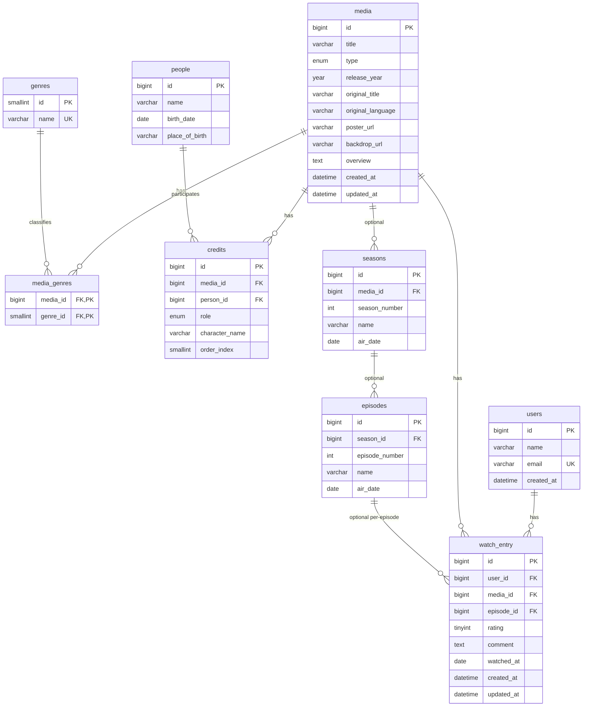

# 🎬 CineLog — Plataforma de Catálogo e Registro de Mídias Assistidas

> Sistema modular, extensível e cloud-ready desenvolvido em **Java 21 + Spring Boot 3**, aplicando **Domain-Driven Design (DDD)**, **Clean Architecture**, e práticas modernas de **observabilidade**, **resiliência** e **escalabilidade**.

---

## 📘 Visão Geral

O **CineLog** é uma aplicação backend para gerenciar **mídias (filmes, séries, episódios, temporadas)** e **entradas de exibição (Watch Entries)**, com suporte a **usuários, gêneros e créditos**.

### ⭐ Novidade: PR6 - Features de Negócio

**5 novas features prontas para produção:**

- 📊 **User Insights** - Estatísticas agregadas do usuário (CQRS + Kafka)
- 🔥 **Media Popularity** - Rankings trending e top-rated (CQRS + Kafka)
- 🔍 **Media Search** - Busca avançada com filtros dinâmicos (Specification Pattern)
- 📺 **Watch Progress** - Rastreamento de progresso em séries (Value Object)
- 🎯 **Recommendations** - Sistema de recomendações personalizadas (Strategy Pattern)

**16 novos endpoints REST** | **5 Design Patterns** | **55+ testes** | [Ver documentação completa →](./docs/PR6_QUICK_REFERENCE.md)

### 📄 Relatórios & PDF

- 📧 **8 tipos de relatório** com envio por e-mail (Thymeleaf + tema dark cinema)
- 📄 **Geração de PDF** sob demanda via **Gotenberg** (HTML → PDF headless)
- 📨 **Anexo de PDF** opcional nos e-mails (`attach-to-email=true`)
- 🔒 **Relatório de plataforma** exclusivo para administradores (landscape)
- **9 endpoints PDF** + preview JSON + envio por e-mail | [Ver API de Relatórios →](./docs/api/REPORTS-API.md)

---

## Modelo de dados



## 🧩 Arquitetura

O projeto segue uma **arquitetura hexagonal (ports & adapters)** com **camadas bem isoladas**:

```
com.cine.cinelog
│
├── core
│   ├── domain                 # Entidades e modelos puros de domínio
│   │   ├── model              # Media, Season, Episode, User, Genre, etc.
│   │   └── enums              # MediaType, Role, etc.
│   ├── application
│   │   ├── ports              # Interfaces in/out (Use Cases + Repository Ports)
│   │   ├── usecase            # Implementações dos casos de uso
│   │   └── config             # Injeção dos beans (UseCaseConfig)
│   └── shared                 # Configurações globais, erros e observabilidade
│
├── features                   # Adapters por domínio (infra/web)
│   ├── media, genres, users, credits, seasons, people, episodes, watchentry
│   │   ├── persistence        # JPA Entities e RepositoryAdapters
│   │   ├── mapper             # MapStruct mappers (Entity ↔ Domain ↔ DTO)
│   │   ├── web                # Controllers + DTOs
│   │   └── repository         # JPA repositories e beans de infraestrutura
│
├── shared                     # Cross-cutting (OpenAPI, error handler, tracing)
└── docker                     # Infraestrutura e docker-compose
```

🧱 **Padrões aplicados**

- Domain-Driven Design (Entities, Value Objects, Domain Services)
- Ports & Adapters (Clean Architecture)
- SOLID, 12-Factor e DRY
- Spring Boot autoconfiguration modular (starter style)
- Observability nativa (OpenTelemetry, logs estruturados)
- Liquibase versionado com rollback seguro

---

## 🚀 Tecnologias Principais

| Camada          | Stack                                 | Propósito                                 |
| --------------- | ------------------------------------- | ----------------------------------------- |
| Core            | Java 21 + Spring Boot 3               | Base de domínio e aplicação               |
| Persistência    | Spring Data JPA + Liquibase + MySQL 8 | ORM, versionamento e schema management    |
| Web             | Spring Web MVC + OpenAPI 3            | API REST tipada e documentada             |
| Observabilidade | Micrometer + OpenTelemetry            | Tracing, métricas e logs estruturados     |
| Build           | Maven Wrapper                         | Reprodutibilidade                         |
| Infra           | Docker + Docker Compose               | Execução local containerizada             |
| Testes          | JUnit 5 + Testcontainers              | Testes unitários e de integração isolados |
| Relatórios      | Thymeleaf + Gotenberg 8               | Templates HTML, geração de PDF headless   |

---

## 📂 Estrutura de Domínio Atual

| Entidade       | Descrição                                        | Relacionamentos        |
| -------------- | ------------------------------------------------ | ---------------------- |
| **Media**      | Filme ou série principal                         | 1-N com Season e Genre |
| **Season**     | Temporada de uma série                           | 1-N com Episode        |
| **Episode**    | Episódio individual                              | Pertence a Season      |
| **Genre**      | Categoria temática                               | N-N com Media          |
| **Credit**     | Participação de uma pessoa (ator, diretor, etc.) | N-N Media ↔ Person     |
| **Person**     | Pessoa (ator, diretor, roteirista)               | Associada via Credit   |
| **User**       | Usuário do sistema                               | 1-N WatchEntries       |
| **WatchEntry** | Registro de visualização                         | Relaciona User ↔ Media |

---

## 🧠 Domínio e Casos de Uso

Cada **Use Case** é uma classe de aplicação independente, declarada em `core.application.usecase.<feature>`  
e exposta como `@Bean` no `UseCaseConfig`.

Exemplo:

```java
@Bean
public CreateMediaUseCase createMediaUseCase(MediaRepositoryPort repo) {
    return new CreateMediaService(repo);
}
```

Cada `UseCase` implementa interfaces `ports.in`, e depende apenas de **ports.out (RepositoryPorts)**, mantendo o domínio **totalmente desacoplado da infraestrutura**.

---

## 🔄 Fluxo de Dados (Request Lifecycle)

```
HTTP Request
   ↓
Controller (DTO ↔ Domain)
   ↓
UseCase (Service de Aplicação)
   ↓
RepositoryPort (interface)
   ↓
RepositoryAdapter (implementação JPA)
   ↓
Database (MySQL 8 / Liquibase)
```

Todos os mapeamentos de entidade ↔ domínio ↔ DTO são feitos via **MapStruct**, garantindo:

- Conversões puras e testáveis
- Desacoplamento completo de frameworks
- Coerência entre camadas

---

## 🧪 Testes

- **Unit Tests** → validam lógica de domínio e casos de uso (`core.application.usecase.*`)
- **Integration Tests** → simulam API e repositórios (`features.*.web` e `features.*.persistence`)
- **Liquibase Testcontainers** → inicializa schema real automaticamente
- **Coverage** → Jacoco configurado para 80%+ mínimo

```bash
./mvnw clean test
```

---

## 🐳 Execução Local

### 1. Banco e dependências

```bash
docker-compose up -d
```

### 2. Build & Run

```bash
./mvnw spring-boot:run
```

### 3. Swagger/OpenAPI

> http://localhost:8080/swagger-ui/index.html  
> Documentação gerada via `springdoc-openapi`.

---

## 🧭 Padrões de Código e Convenções

- Pacotes organizados por **feature**, não por camada.
- **DTOs, Entities e Domain Models** têm mappers dedicados.
- **Controllers** expõem contratos REST puros (sem lógica).
- **Liquibase** versiona o schema incrementalmente.
- **Observabilidade** configurada via `shared/observability`.

---

## 🔐 Segurança (Planejada)

- JWT (Access + Refresh)
- RBAC (`Role.USER`, `Role.ADMIN`)
- Password hashing (Argon2 / BCrypt)
- Feature Flags (`featureFlags.security.enabled=true`)

---

## 📊 Observabilidade (Planejada)

- **OpenTelemetry auto-instrumentation** para Spring + JDBC
- **Logs estruturados** (JSON com traceId/spanId)
- **MDC context propagation**
- **Future:** exporter para Grafana / Tempo / Prometheus

---

## 🧱 Liquibase & Schema

Arquivos em:

```
src/main/resources/liquibase
├── db.changelog-master.xml
├── changes/
│   ├── create_initial_tables.xml
│   ├── initial_table_links.xml
│   ├── create_audit_table.xml
│   └── create_audit_triggers.xml
```

Cada `changelog` possui rollback definido e segue convenção `yyyymmddhhmmss_description.xml`.

---

## 🧰 Roadmap Técnico (Short-Term)

| Prioridade | Item                               | Objetivo                              |
| ---------- | ---------------------------------- | ------------------------------------- |
| 🔹 1       | Autenticação JWT + RBAC            | Camada de segurança real              |
| 🔹 2       | Observabilidade completa           | Tracing, métricas e logs estruturados |
| 🔹 3       | Cache e paginação avançada         | Performance e UX                      |
| 🔹 4       | Outbox / Event-Driven              | Integração assíncrona e resiliência   |
| 🔹 5       | Testcontainers + Seed de dados     | Testes isolados e realistas           |
| 🔹 6       | Documentação ADR + C4              | Transparência e governança            |
| 🔹 7       | SDK TypeScript (OpenAPI Generator) | Melhorar DX para consumidores         |

---

## 🧩 Stack Completa

| Tipo            | Tecnologia                  |
| --------------- | --------------------------- |
| Linguagem       | Java 21                     |
| Framework       | Spring Boot 3               |
| Build           | Maven Wrapper               |
| Banco           | MySQL 8                     |
| ORM             | Hibernate 6 / JPA           |
| Migrações       | Liquibase                   |
| Docs API        | SpringDoc OpenAPI 3         |
| Mapper          | MapStruct                   |
| Containerização | Docker Compose              |
| Testes          | JUnit 5, Testcontainers     |
| Observabilidade | Micrometer, OpenTelemetry   |
| Segurança       | Spring Security (planejada) |

---

## 🏗️ Pipeline CI/CD (Planejado)

```
name: ci
on: [push, pull_request]
jobs:
  build:
    runs-on: ubuntu-latest
    steps:
      - uses: actions/checkout@v4
      - uses: actions/setup-java@v4
        with:
          distribution: temurin
          java-version: 21
      - run: ./mvnw verify
      - name: Sonar Scan
        uses: sonarsource/sonarcloud-github-action@v2
      - name: Build & Push Docker
        run: docker build -t ghcr.io/marcusprado/cinelog:latest .
```

---

## 📄 Licença

MIT © 2025 — **Marcus Prado Silva**  
Projeto acadêmico e demonstrativo de arquitetura corporativa moderna.

---

## 🧠 Créditos

Arquitetura e desenvolvimento: [Marcus Prado Silva](https://github.com/marcusprado)  
Mentoria técnica (IA-assistida): Infinity Engineer — “Big Tech-style Engineering System”
