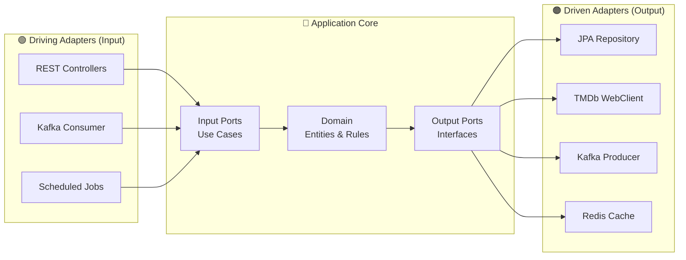
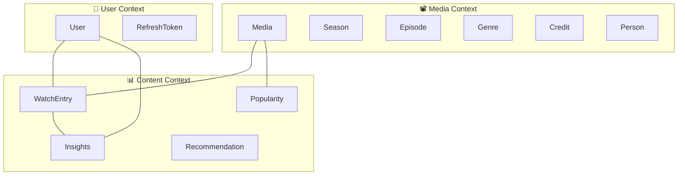
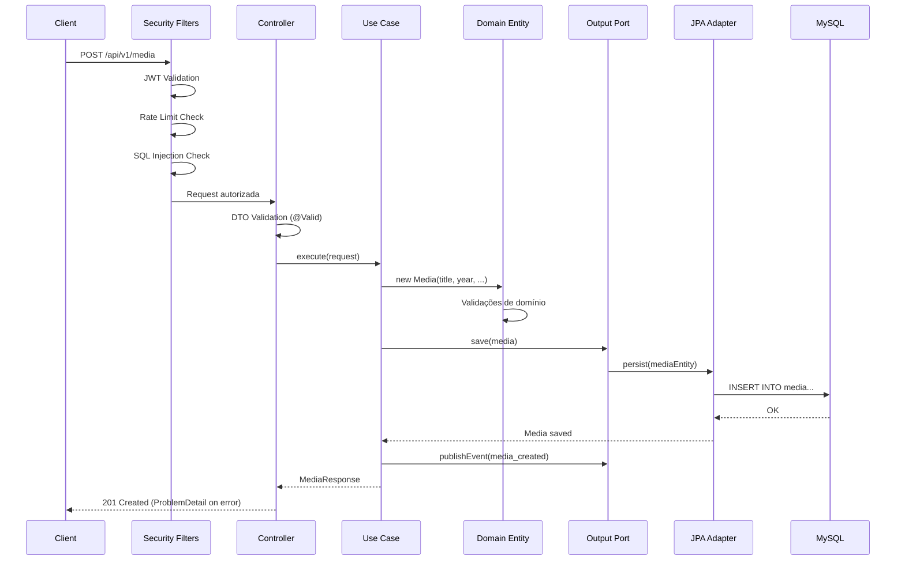
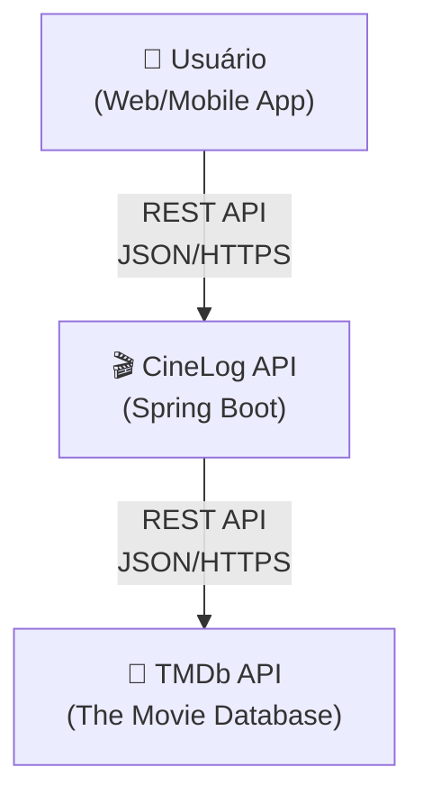
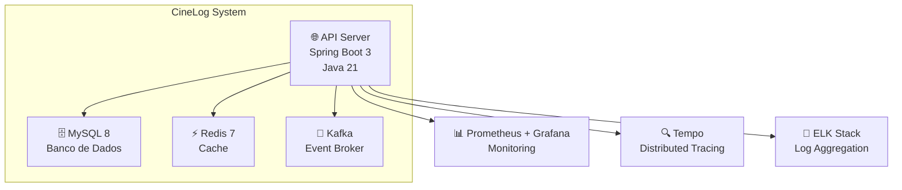

# 🏗️ Architecture

> Visão detalhada da arquitetura do CineLog: Hexagonal Architecture, DDD, Clean Architecture e padrões SOLID.

---

## Princípios Fundamentais

| Princípio                  | Aplicação no CineLog                             |
| -------------------------- | ------------------------------------------------ |
| **Separation of Concerns** | Cada camada tem responsabilidade única           |
| **Dependency Inversion**   | Domínio não depende de frameworks                |
| **Open/Closed**            | Extensível via ports/adapters sem alterar o core |
| **Single Responsibility**  | Classes pequenas e focadas                       |
| **YAGNI + DRY**            | Sem abstrações prematuras, sem duplicação        |

---

## Arquitetura em Camadas

```
┌─────────────────────────────────────────────┐
│              Presentation Layer              │
│        (Controllers, DTOs, Mappers)          │
├─────────────────────────────────────────────┤
│              Application Layer               │
│       (Use Cases, Input/Output Ports)        │
├─────────────────────────────────────────────┤
│               Domain Layer                   │
│    (Entities, Value Objects, Domain Events)   │
├─────────────────────────────────────────────┤
│            Infrastructure Layer              │
│  (JPA, WebClient, Kafka, Redis, Security)    │
└─────────────────────────────────────────────┘
```

### Regra de Dependência

> As dependências apontam **sempre para dentro** — a camada de domínio não conhece nenhuma camada externa.

```
Infrastructure → Application → Domain ← Application ← Infrastructure
                      ↕
              (Ports são interfaces)
```

---

## Hexagonal Architecture (Ports & Adapters)



### Ports (Interfaces no domínio)

**Input Ports** — definem o que a aplicação faz:

```java
public interface CreateMediaUseCase {
    MediaResponse execute(CreateMediaRequest request);
}
```

**Output Ports** — definem o que a aplicação precisa:

```java
public interface MediaRepositoryPort {
    Optional<Media> findById(Long id);
    Media save(Media media);
}

public interface TmdbClientPort {
    Optional<TmdbMediaDetails> fetchByTmdbId(Long tmdbId);
}
```

### Adapters (Implementações concretas)

**Driving Adapter** (REST Controller):

```java
@RestController
@RequestMapping("/api/v1/media")
public class MediaController {
    private final CreateMediaUseCase createMediaUseCase; // Input Port
}
```

**Driven Adapter** (JPA Repository):

```java
@Component
public class MediaRepositoryAdapter implements MediaRepositoryPort {
    private final MediaJpaRepository jpaRepository; // Spring Data
}
```

---

## Estrutura de Pacotes

```
com.cine.cinelog/
├── core/                        # 🔵 Núcleo da aplicação
│   ├── domain/
│   │   ├── model/               # Entidades de domínio (POJO puro)
│   │   ├── enums/               # Enums de domínio (MediaType, Role)
│   │   ├── error/               # Exceções de domínio (DomainException)
│   │   └── event/               # Eventos de domínio (EventEnvelope)
│   └── application/
│       └── ports/
│           ├── in/              # Input Ports (Use Cases)
│           └── out/             # Output Ports (Repositories, Clients)
│
├── features/                    # 🟢 Features por bounded context
│   ├── media/
│   │   ├── controller/          # REST endpoints
│   │   ├── service/             # Use case implementations
│   │   ├── dto/                 # Request/Response DTOs
│   │   ├── mapper/              # MapStruct mappers
│   │   ├── repository/          # JPA entities + Spring Data repos
│   │   └── integration/tmdb/    # TMDb adapter
│   ├── auth/                    # Autenticação (Login, Register, JWT)
│   ├── user/                    # Gestão de usuários
│   ├── watchentry/              # Watch entries (State Pattern)
│   ├── insights/                # User Insights (CQRS)
│   ├── popularity/              # Media Popularity (Wilson Score)
│   └── recommendation/          # Recomendações (Strategy Pattern)
│
├── infrastructure/              # 🟠 Adaptadores de infraestrutura
│   ├── events/                  # Outbox Pattern publisher
│   ├── messaging/kafka/         # Kafka producer + consumer + DLQ
│   └── persistence/             # Configurações JPA
│
└── shared/                      # ⚪ Módulos transversais
    ├── config/                  # Configurações Spring (Security, CORS, etc.)
    ├── error/                   # GlobalExceptionHandler (RFC 9457)
    ├── security/                # Filtros (JWT, Rate Limit, SQLi)
    └── observability/           # Métricas, tracing, audit, health
```

---

## DDD — Domain-Driven Design

### Bounded Contexts



### Entidades vs Value Objects

| Tipo               | Exemplos                       | Identidade             |
| ------------------ | ------------------------------ | ---------------------- |
| **Entity**         | Media, User, WatchEntry        | Tem ID único           |
| **Value Object**   | Rating, DateRange, TMDB ID     | Definido por atributos |
| **Aggregate Root** | Media (root de Season/Episode) | Controla consistência  |

---

## Ciclo de Vida de uma Request



---

## Design Patterns Aplicados

| Padrão              | Onde                                     | Propósito                   |
| ------------------- | ---------------------------------------- | --------------------------- |
| **Repository**      | `*RepositoryPort` + `*RepositoryAdapter` | Abstrai persistência        |
| **Mapper**          | MapStruct `*Mapper`                      | Conversão Entity ↔ DTO      |
| **Strategy**        | `RecommendationStrategy`                 | Algoritmos intercambiáveis  |
| **State**           | `WatchEntryState`                        | Ciclo de vida de WatchEntry |
| **Template Method** | `AbstractMediaValidator`                 | Validação extensível        |
| **Factory**         | `WatchStateFactory`                      | Criação de estados          |
| **Observer**        | Outbox + Kafka Events                    | Eventos assíncronos         |
| **Adapter**         | `TmdbClientAdapter`                      | Integração com API externa  |
| **Circuit Breaker** | Resilience4j no TMDb                     | Resiliência a falhas        |

👉 **Ver detalhes**: [Design Patterns](Design-Patterns)

---

## Diagramas C4

### Nível 1 — Contexto do Sistema



### Nível 2 — Containers



---

## Referências

- [ADR Index](ADR-Index) — Todas as decisões arquiteturais
- [Clean Architecture — Robert C. Martin](https://blog.cleancoder.com/uncle-bob/2012/08/13/the-clean-architecture.html)
- [Hexagonal Architecture — Alistair Cockburn](https://alistair.cockburn.us/hexagonal-architecture/)
- [Domain-Driven Design — Eric Evans](https://www.domainlanguage.com/ddd/)
