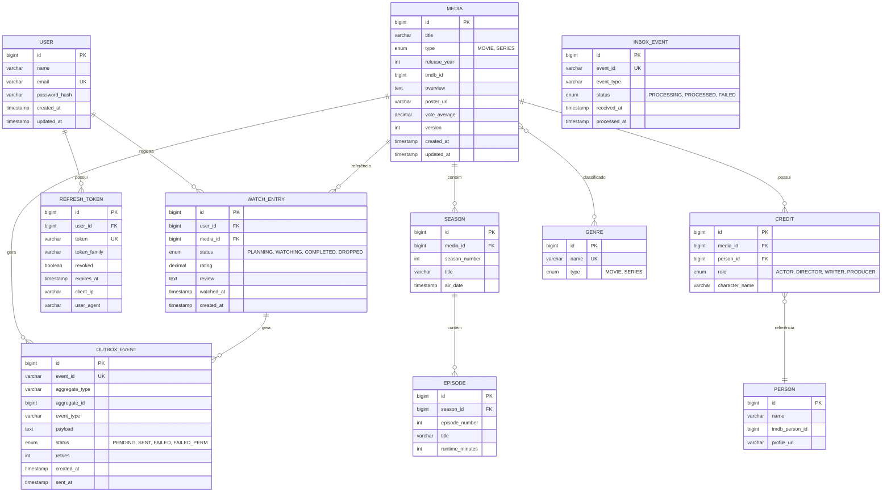

# 🗄️ Database & Migrations

> MySQL, Liquibase, Redis e estratégias de persistência no CineLog.

---

## Stack de Dados

| Tecnologia        | Uso                        | Porta |
| ----------------- | -------------------------- | ----- |
| **MySQL 8.0**     | Banco relacional principal | 3306  |
| **Redis 7**       | Cache distribuído          | 6379  |
| **Liquibase 5.0** | Migrações de schema        | —     |
| **HikariCP**      | Pool de conexões           | —     |

---

## Modelo de Dados



---

## Configuração do MySQL

```yaml
spring:
    datasource:
        url: jdbc:mysql://localhost:3306/cinelog
        username: cinelog
        password: cinelog
        hikari:
            minimum-idle: 2
            maximum-pool-size: 10
            connection-timeout: 5000
            idle-timeout: 300000
            max-lifetime: 600000
            transaction-isolation: TRANSACTION_READ_COMMITTED

    jpa:
        hibernate:
            ddl-auto: none # Liquibase gerencia o schema
        open-in-view: false # Evitar N+1 queries
        properties:
            hibernate.format_sql: false
            hibernate.generate_statistics: false
```

### Por que `ddl-auto: none`?

O Hibernate **nunca** deve modificar o schema em produção. Todas as alterações são feitas via **Liquibase migrations**, garantindo:

- Versionamento do schema
- Rollback controlado
- Auditoria de mudanças
- Reprodutibilidade entre ambientes

---

## Liquibase Migrations

### Estrutura

```
src/main/resources/
├── db/changelog/
│   ├── changelog-master.xml          # Master changelog
│   ├── 20250101000000_create_media.xml
│   ├── 20250101000001_create_user.xml
│   ├── 20250101000002_create_watch_entry.xml
│   └── ...
└── liquibase/
    └── liquibase.properties
```

### Nomenclatura

```
YYYYMMDDHHmmss_description.xml
```

Exemplo: `20250115103000_add_tmdb_id_to_media.xml`

### Como Criar uma Nova Migration

1. Crie o arquivo XML na pasta `db/changelog/`:

```xml
<?xml version="1.0" encoding="UTF-8"?>
<databaseChangeLog xmlns="http://www.liquibase.org/xml/ns/dbchangelog"
    xmlns:xsi="http://www.w3.org/2001/XMLSchema-instance"
    xsi:schemaLocation="http://www.liquibase.org/xml/ns/dbchangelog
        http://www.liquibase.org/xml/ns/dbchangelog/dbchangelog-latest.xsd">

    <changeSet id="20250115103000-1" author="marcus">
        <addColumn tableName="media">
            <column name="tmdb_id" type="BIGINT">
                <constraints nullable="true"/>
            </column>
        </addColumn>
        <createIndex tableName="media" indexName="idx_media_tmdb_id">
            <column name="tmdb_id"/>
        </createIndex>
    </changeSet>

</databaseChangeLog>
```

2. Inclua no `changelog-master.xml`:

```xml
<include file="db/changelog/20250115103000_add_tmdb_id_to_media.xml"/>
```

3. Execute: `./mvnw spring-boot:run` (Liquibase aplica automaticamente no startup)

### Boas Práticas

| Prática                             | Motivo                      |
| ----------------------------------- | --------------------------- |
| Um changeSet por alteração          | Permite rollback granular   |
| Sempre adicione `author`            | Rastreabilidade             |
| Nunca edite changeSets existentes   | Liquibase usa checksums     |
| Use `rollback` tag                  | Para alterações reversíveis |
| Teste com `./mvnw liquibase:update` | Antes de mergear            |

---

## Redis (Cache)

### Configuração

```yaml
spring:
    data:
        redis:
            host: localhost
            port: 6379
            database: 0
            timeout: 2000ms
    cache:
        type: redis
```

### Estratégia de Cache

| Cache             | TTL   | Uso                                       |
| ----------------- | ----- | ----------------------------------------- |
| `tmdb`            | 24h   | Dados do TMDb (detalhes, gêneros, config) |
| `media`           | 1h    | Mídias mais acessadas                     |
| `genres`          | 24h   | Lista de gêneros                          |
| `popularity`      | 30min | Rankings de popularidade                  |
| `recommendations` | 1h    | Recomendações por usuário                 |
| `user-insights`   | 15min | Estatísticas de consumo                   |

### Invalidação

- **Cache-aside**: leitura com fallback para DB, escrita invalida cache
- **TTL-based**: expiração automática por tempo
- **Event-based**: eventos Kafka podem invalidar caches em outros serviços

```java
@Cacheable(cacheNames = "media", key = "#id")
public MediaResponse findById(Long id) { ... }

@CacheEvict(cacheNames = "media", key = "#id")
public void update(Long id, UpdateMediaRequest request) { ... }
```

---

## Índices de Performance

As migrações incluem índices para as queries mais comuns:

| Tabela          | Índice              | Colunas    |
| --------------- | ------------------- | ---------- |
| `media`         | `idx_media_type`    | `type`     |
| `media`         | `idx_media_tmdb_id` | `tmdb_id`  |
| `media`         | `idx_media_title`   | `title`    |
| `watch_entry`   | `idx_we_user_id`    | `user_id`  |
| `watch_entry`   | `idx_we_media_id`   | `media_id` |
| `watch_entry`   | `idx_we_status`     | `status`   |
| `outbox_event`  | `idx_outbox_status` | `status`   |
| `refresh_token` | `idx_rt_user_id`    | `user_id`  |
| `refresh_token` | `idx_rt_token`      | `token`    |

---

## Docker Compose (MySQL)

```yaml
services:
    db:
        image: mysql:8.0
        environment:
            MYSQL_ROOT_PASSWORD: root
            MYSQL_DATABASE: cinelog
            MYSQL_USER: cinelog
            MYSQL_PASSWORD: cinelog
        ports:
            - "3306:3306"
        volumes:
            - dbdata:/var/lib/mysql
            - ./docker/mysql-init.sql:/docker-entrypoint-initdb.d/init.sql
```

---

## Referências

- [ADR-003: Liquibase para Migrações](ADR-Index)
- [ADR-007: Redis para Cache](ADR-Index)
- [Liquibase Documentation](https://docs.liquibase.com/)
- [HikariCP Configuration](https://github.com/brettwooldridge/HikariCP)
