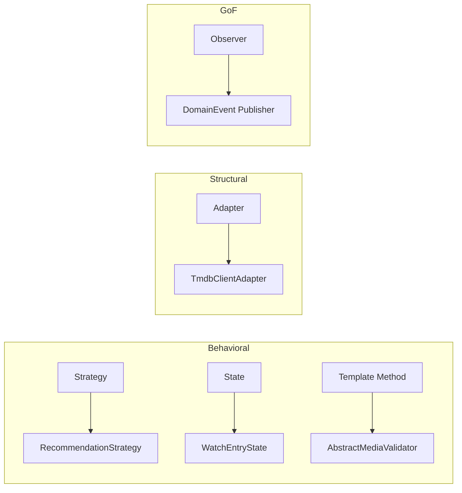
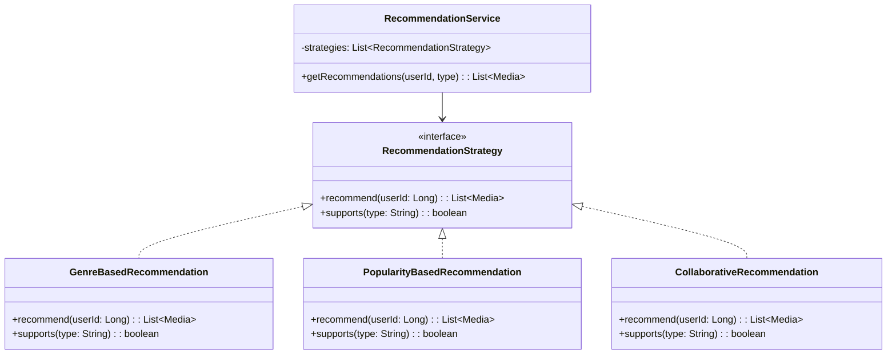
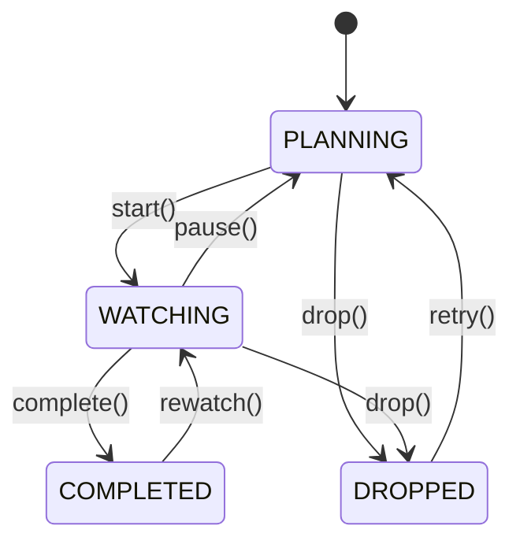

# 🎨 Design Patterns

> Padrões de projeto aplicados no CineLog com exemplos reais.

---

## Padrões Implementados



---

## 1. Strategy Pattern — Recomendações

### Problema

Diferentes algoritmos de recomendação de mídia: por gênero, por popularidade, por usuários similares.

### Solução



### Código

```java
// Port (Interface)
public interface RecommendationStrategy {
    List<MediaResponse> recommend(Long userId);
    boolean supports(String type);
}

// Strategies
@Component
public class GenreBasedRecommendation implements RecommendationStrategy {
    @Override
    public List<MediaResponse> recommend(Long userId) {
        // Recomenda baseado nos gêneros favoritos do usuário
        var favoriteGenres = watchEntryPort.findTopGenresByUser(userId);
        return mediaPort.findByGenres(favoriteGenres);
    }

    @Override
    public boolean supports(String type) {
        return "genre".equals(type);
    }
}

@Component
public class PopularityBasedRecommendation implements RecommendationStrategy {
    @Override
    public List<MediaResponse> recommend(Long userId) {
        return mediaPort.findMostPopular(20);
    }

    @Override
    public boolean supports(String type) {
        return "popularity".equals(type);
    }
}

// Service — seleciona a estratégia
@Service
@RequiredArgsConstructor
public class RecommendationService {
    private final List<RecommendationStrategy> strategies;

    public List<MediaResponse> getRecommendations(Long userId, String type) {
        return strategies.stream()
            .filter(s -> s.supports(type))
            .findFirst()
            .orElseThrow(() -> new UnsupportedOperationException("Strategy not found: " + type))
            .recommend(userId);
    }
}
```

### Benefícios

- ✅ **Open/Closed**: Adicionar nova estratégia = nova classe, sem alterar existente
- ✅ **Testável**: cada estratégia testada isoladamente
- ✅ **Spring IoC**: injeção automática de todas as implementações

---

## 2. State Pattern — Ciclo de Vida de WatchEntry

### Problema

Um `WatchEntry` passa por estados (PLANNING → WATCHING → COMPLETED/DROPPED) com regras de transição.

### Diagrama de Estados



### Código

```java
// Estado base
public interface WatchEntryState {
    WatchEntryStatus getStatus();
    WatchEntryState start();
    WatchEntryState complete();
    WatchEntryState drop();
    WatchEntryState pause();
    WatchEntryState rewatch();

    default WatchEntryState retry() {
        throw new InvalidStateTransitionException(getStatus(), "retry");
    }
}

// Estado: PLANNING
public class PlanningState implements WatchEntryState {
    @Override
    public WatchEntryStatus getStatus() { return PLANNING; }

    @Override
    public WatchEntryState start() { return new WatchingState(); }

    @Override
    public WatchEntryState drop() { return new DroppedState(); }

    @Override
    public WatchEntryState complete() {
        throw new InvalidStateTransitionException(PLANNING, "complete");
    }
}

// Estado: WATCHING
public class WatchingState implements WatchEntryState {
    @Override
    public WatchEntryStatus getStatus() { return WATCHING; }

    @Override
    public WatchEntryState complete() { return new CompletedState(); }

    @Override
    public WatchEntryState drop() { return new DroppedState(); }

    @Override
    public WatchEntryState pause() { return new PlanningState(); }
}

// Uso na entidade
public class WatchEntry {
    private WatchEntryState state;

    public void start() {
        this.state = state.start();
    }

    public void complete() {
        this.state = state.complete();
    }
}
```

### Benefícios

- ✅ **Sem if/switch**: transições encapsuladas nos estados
- ✅ **Regras claras**: cada estado sabe suas transições válidas
- ✅ **Extensível**: novo estado = nova classe

---

## 3. Template Method — Validação de Mídia

### Problema

Validação de filmes e séries compartilha passos comuns, mas com especificidades.

### Código

```java
// Template base
public abstract class AbstractMediaValidator {

    // Template method
    public final void validate(MediaRequest request) {
        validateCommonFields(request);
        validateSpecificFields(request);
        validateBusinessRules(request);
    }

    // Passos comuns
    private void validateCommonFields(MediaRequest request) {
        Objects.requireNonNull(request.getTitle(), "Título obrigatório");
        Objects.requireNonNull(request.getType(), "Tipo obrigatório");
        if (request.getReleaseYear() < 1888) {
            throw new ValidationException("Ano inválido");
        }
    }

    // Passos específicos — implementados pelas subclasses
    protected abstract void validateSpecificFields(MediaRequest request);
    protected abstract void validateBusinessRules(MediaRequest request);
}

// Validador de filmes
@Component
public class MovieValidator extends AbstractMediaValidator {
    @Override
    protected void validateSpecificFields(MediaRequest request) {
        if (request.getRuntimeMinutes() == null) {
            throw new ValidationException("Duração obrigatória para filmes");
        }
    }

    @Override
    protected void validateBusinessRules(MediaRequest request) {
        // Regras específicas de filmes
    }
}

// Validador de séries
@Component
public class SeriesValidator extends AbstractMediaValidator {
    @Override
    protected void validateSpecificFields(MediaRequest request) {
        if (request.getSeasons() == null || request.getSeasons() < 1) {
            throw new ValidationException("Séries devem ter ao menos 1 temporada");
        }
    }

    @Override
    protected void validateBusinessRules(MediaRequest request) {
        // Regras específicas de séries
    }
}
```

### Benefícios

- ✅ **DRY**: lógica comum centralizada na classe abstrata
- ✅ **Extensível**: novo tipo de mídia = nova subclasse
- ✅ **Consistente**: ordem de validação sempre mantida

---

## 4. Adapter Pattern — Integração TMDb

### Problema

A aplicação não deve depender diretamente da API do TMDb.

### Código

```java
// Port (no core)
public interface TmdbPort {
    Optional<TmdbMovie> searchMovie(String title);
    Optional<TmdbSeries> searchSeries(String title);
    List<TmdbGenre> getGenres();
}

// Adapter (na infrastructure)
@Component
@RequiredArgsConstructor
public class TmdbClientAdapter implements TmdbPort {
    private final TmdbApiClient apiClient;
    private final TmdbMapper mapper;

    @Override
    @CircuitBreaker(name = "tmdb", fallbackMethod = "searchMovieFallback")
    @Retry(name = "tmdb")
    @Cacheable(cacheNames = "tmdb", key = "'movie:' + #title")
    public Optional<TmdbMovie> searchMovie(String title) {
        var response = apiClient.searchMovies(title);
        return response.getResults().stream()
            .findFirst()
            .map(mapper::toDomain);
    }

    // Fallback
    private Optional<TmdbMovie> searchMovieFallback(String title, Exception ex) {
        log.warn("TMDb unavailable, returning empty for: {}", title);
        return Optional.empty();
    }
}
```

---

## 5. Observer Pattern — Domain Events

### Problema

Ações de domínio (criar mídia, completar watch entry) devem disparar efeitos colaterais sem acoplamento direto.

### Código

```java
// Evento
public record MediaCreatedEvent(
    Long mediaId,
    String title,
    MediaType type,
    Instant occurredAt
) implements DomainEvent {}

// Publicação (dentro do use case)
public class CreateMediaUseCase {
    private final ApplicationEventPublisher eventPublisher;

    public MediaResponse execute(CreateMediaRequest request) {
        var media = mediaRepository.save(mapper.toDomain(request));
        eventPublisher.publishEvent(new MediaCreatedEvent(
            media.getId(), media.getTitle(),
            media.getType(), Instant.now()
        ));
        return mapper.toResponse(media);
    }
}

// Listener (desacoplado)
@Component
public class MediaCreatedListener {
    @TransactionalEventListener(phase = AFTER_COMMIT)
    public void handle(MediaCreatedEvent event) {
        // Envia para Outbox → Kafka
        outboxService.save(event);
    }
}
```

---

## Resumo

| Padrão              | Onde                 | Princípio SOLID            |
| ------------------- | -------------------- | -------------------------- |
| **Strategy**        | Recomendações        | Open/Closed, DIP           |
| **State**           | WatchEntry lifecycle | Single Responsibility, OCP |
| **Template Method** | Validação de mídia   | DRY, OCP                   |
| **Adapter**         | TMDb integration     | DIP, ISP                   |
| **Observer**        | Domain Events        | SRP, OCP                   |

---

## Referências

- [ADR-008: Design Patterns Implementation](ADR-Index)
- [Head First Design Patterns](https://www.oreilly.com/library/view/head-first-design/9781492077992/)
- [Refactoring Guru — Design Patterns](https://refactoring.guru/design-patterns)
