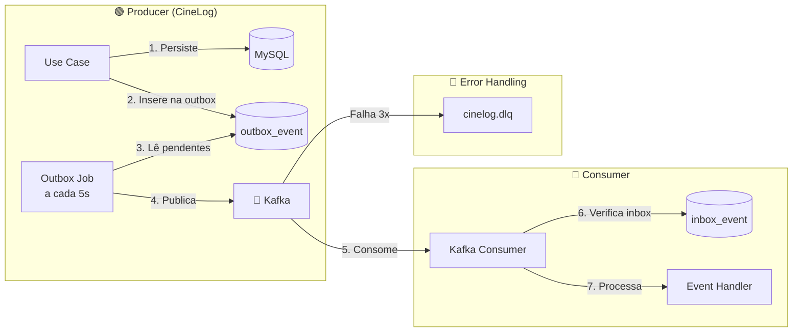
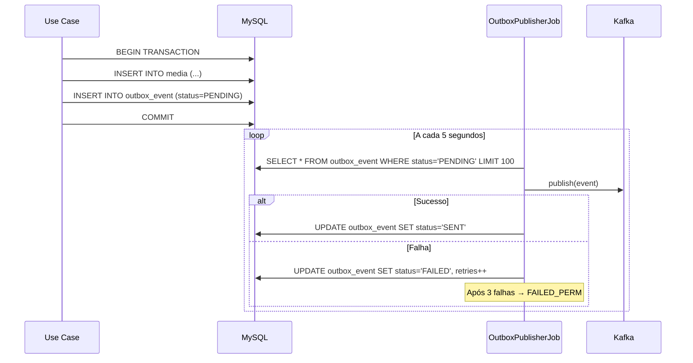
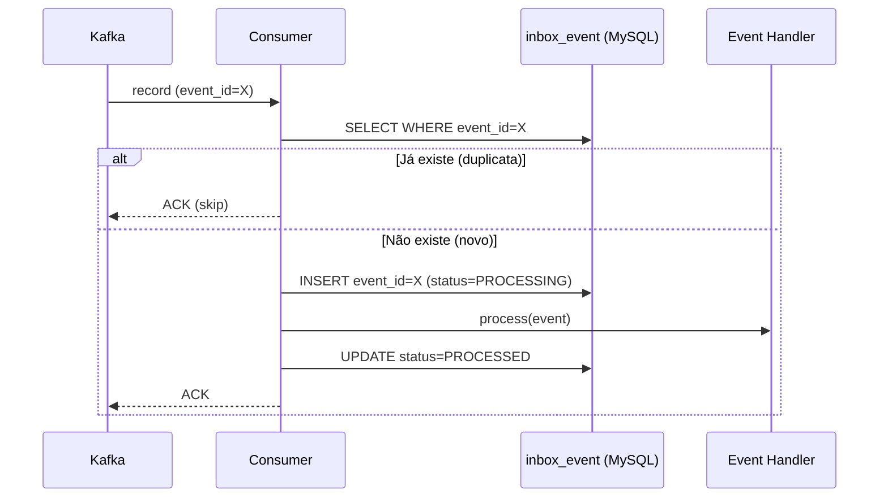

# 📨 Events & Messaging

> Kafka, Outbox Pattern, Event Envelope, Inbox Pattern e DLQ no CineLog.

---

## Visão Geral

O CineLog usa **Apache Kafka** como broker de eventos, implementando o **Outbox Pattern** para garantir atomicidade entre operações de banco e publicação de eventos, e o **Inbox Pattern** para consumo idempotente.



---

## Event Envelope

Todos os eventos seguem o formato **EventEnvelope** padronizado:

```json
{
  "event_id": "550e8400-e29b-41d4-a716-446655440000",
  "type": "watch_entry_created",
  "version": 1,
  "occurred_at": "2025-01-15T10:30:00.123Z",
  "producer": "cinelog-api",
  "metadata": {
    "correlationId": "req-abc123",
    "causationId": "cmd-def456",
    "traceparent": "00-abc123-def456-01",
    "userId": "42"
  },
  "payload": {
    "watchEntryId": 1,
    "userId": 42,
    "mediaId": 100,
    "status": "COMPLETED",
    "rating": 9.5
  }
}
```

### Campos do Envelope

| Campo | Tipo | Descrição |
|---|---|---|
| `event_id` | UUID | Identificador único (idempotência) |
| `type` | string | Tipo do evento (snake_case) |
| `version` | int | Versão do schema do payload |
| `occurred_at` | ISO-8601 | Quando o evento ocorreu |
| `producer` | string | Serviço que gerou o evento |
| `metadata` | object | Contexto de rastreamento |
| `payload` | object | Dados do evento (varia por tipo) |

---

## Catálogo de Eventos

### Eventos de Watch Entry

| Tipo | Tópico Kafka | Trigger |
|---|---|---|
| `watch_entry_created` | `cinelog.watch-entry.created` | Novo registro de mídia assistida |
| `watch_entry_updated` | `cinelog.watch-entry.updated` | Atualização de status, rating ou review |
| `watch_entry_deleted` | `cinelog.watch-entry.deleted` | Remoção de registro |

### Eventos de Media

| Tipo | Tópico Kafka | Trigger |
|---|---|---|
| `media_created` | `cinelog.media.created` | Nova mídia cadastrada |
| `media_updated` | `cinelog.media.updated` | Atualização de dados da mídia |

### Eventos de User

| Tipo | Tópico Kafka | Trigger |
|---|---|---|
| `user_registered` | `cinelog.user.registered` | Novo usuário registrado |

---

## Outbox Pattern

### Por que usar?

O **problema clássico** de dual-write:

```
❌ SEM Outbox:
1. INSERT media no MySQL  ← pode ter sucesso
2. PUBLISH evento no Kafka ← pode falhar!
→ Banco e Kafka ficam inconsistentes
```

```
✅ COM Outbox:
1. BEGIN TRANSACTION
2. INSERT media no MySQL
3. INSERT outbox_event no MySQL  ← mesma transação!
4. COMMIT
5. Job separado publica do outbox → Kafka
→ Consistência eventual garantida
```

### Fluxo Detalhado



### Configuração

```yaml
outbox:
  publisher:
    enabled: true
    fixed-rate-ms: 5000      # Polling a cada 5s
    initial-delay-ms: 10000  # Espera 10s após startup
    batch-size: 100           # Até 100 eventos por batch
    retention-days: 7         # Remove SENT após 7 dias
  housekeeping:
    cron: 0 0 1 * * ?         # Cleanup diário às 01:00
```

---

## Inbox Pattern (Consumo Idempotente)

### Fluxo



### Housekeeping

O `InboxHousekeepingJob` executa diariamente às 03:00, removendo eventos processados há mais de N dias.

---

## DLQ (Dead Letter Queue)

Quando um evento **falha 3 vezes** (exponential backoff: 1s → 2s → 4s), é enviado para o tópico `cinelog.dlq`.

### Configuração do Error Handler

```java
// KafkaConsumerConfig.java
var backOff = new ExponentialBackOffWithMaxRetries(3);
backOff.setInitialInterval(1000L);
backOff.setMultiplier(2.0);
backOff.setMaxInterval(10_000L);

var errorHandler = new DefaultErrorHandler(deadLetterPublisher, backOff);
```

### Kafka Producer (Idempotente)

```yaml
spring.kafka.producer:
  acks: all             # Aguarda confirmação de todas as réplicas
  retries: 3            # Retenta até 3x
  properties:
    enable.idempotence: true  # Exatamente uma vez (exactly-once)
```

---

## Convenções de Nomenclatura

| Elemento | Formato | Exemplo |
|---|---|---|
| **Event type** | snake_case | `watch_entry_created` |
| **Topic name** | kebab-case | `cinelog.watch-entry.created` |
| **Payload fields** | camelCase | `watchEntryId`, `userId` |
| **Topic prefix** | `cinelog.` | `cinelog.media.created` |

---

## Versionamento de Eventos

### Mudanças Compatíveis (não incrementa versão)

- Adicionar campo opcional ao payload
- Adicionar campo ao metadata

### Mudanças Incompatíveis (incrementa versão)

- Remover campo do payload
- Alterar tipo de campo
- Alterar semântica de campo existente

### Estratégia de Compatibilidade

O consumer deve ser **forward-compatible**: ignorar campos desconhecidos e ter defaults para campos ausentes.

---

## Referências

- [ADR-006: Kafka Outbox + Idempotent Consumer](ADR-Index)
- [ADR-009: Event Envelope Versioning](ADR-Index)
- [Microservices Patterns — Chris Richardson](https://microservices.io/patterns/data/transactional-outbox.html)
