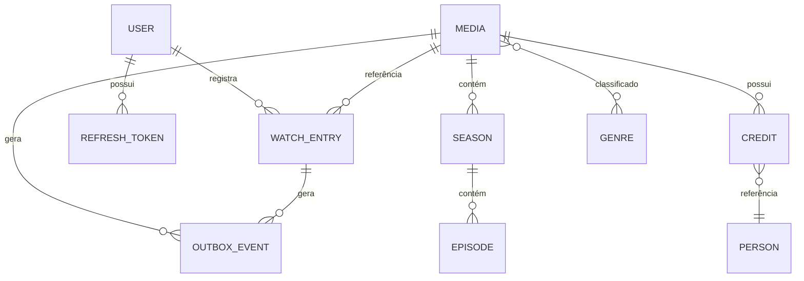

# 🎬 CineLog — Wiki

> **Plataforma de Catálogo e Registro de Mídias Assistidas**

---

## O que é o CineLog?

O CineLog é uma API REST completa para gerenciamento de mídias assistidas (filmes e séries). Construído com **Java 21** e **Spring Boot 3**, segue princípios de **Arquitetura Hexagonal**, **DDD** e **Clean Architecture**, servindo como referência de boas práticas em desenvolvimento backend.

### Principais funcionalidades

| Funcionalidade | Descrição |
|---|---|
| 📚 **Catálogo de Mídias** | CRUD completo de filmes e séries com integração TMDb |
| 👁️ **Watch Entries** | Registro de mídias assistidas com progresso e avaliação |
| 🔐 **Autenticação JWT** | Register, Login, Refresh Token com rotação segura |
| 📊 **User Insights** | Estatísticas de consumo de mídia por usuário |
| 🔍 **Busca Avançada** | Pesquisa com filtros, paginação e ordenação |
| 🎯 **Recomendações** | Sistema baseado em Strategy Pattern (Content-Based, Collaborative, Hybrid) |
| 📈 **Popularidade** | Rankings com decaimento temporal e Score de Wilson |
| 📡 **Eventos Kafka** | Outbox Pattern com Inbox idempotente e DLQ |

### Stack Tecnológica

| Camada | Tecnologia | Versão |
|---|---|---|
| **Linguagem** | Java (LTS) | 21 |
| **Framework** | Spring Boot | 3.5.11 |
| **Banco de Dados** | MySQL | 8.0 |
| **Cache** | Redis | 7 |
| **Mensageria** | Apache Kafka | 3.9 |
| **Migrações** | Liquibase | 5.0.1 |
| **Métricas** | Prometheus + Grafana | latest |
| **Tracing** | OpenTelemetry + Tempo | latest |
| **Logs** | Logstash + ELK | 8.15 |
| **Documentação** | OpenAPI (Swagger) | 3.0 |
| **Segurança** | Spring Security + JWT | 6.x |
| **Resiliência** | Resilience4j | 2.3.0 |

### Números do projeto

| Métrica | Valor |
|---|---|
| Endpoints REST | 35+ |
| Cobertura de testes | 82%+ |
| Linhas de código | ~15.000 |
| ADRs documentados | 10 |
| OWASP Top 10:2025 | 10/10 implementados |

---

## Navegação Rápida

### 🚀 Primeiros Passos
- [**Getting Started**](Getting-Started) — Instale e rode o projeto em minutos
- [**Configuration**](Configuration) — Variáveis de ambiente e profiles

### 🏗️ Arquitetura & Design
- [**Architecture**](Architecture) — Hexagonal, DDD, Clean Architecture
- [**Design Patterns**](Design-Patterns) — Strategy, State, Template Method
- [**ADR Index**](ADR-Index) — Decisões arquiteturais documentadas

### 📡 API & Integração
- [**API Reference**](API-Reference) — Todos os endpoints REST documentados
- [**Events & Messaging**](Events-and-Messaging) — Kafka, Outbox, Event Catalog

### 🔒 Segurança
- [**Security (OWASP)**](Security) — OWASP Top 10:2025 completo

### 📊 Operações
- [**Observability**](Observability) — Logs, métricas, tracing distribuído
- [**Database & Migrations**](Database-and-Migrations) — MySQL, Liquibase, Redis
- [**Deployment**](Deployment) — Docker, Kubernetes, CI/CD, Cloud

### 🧪 Qualidade
- [**Testing**](Testing) — Pirâmide de testes, JaCoCo, Testcontainers

### 🤝 Comunidade
- [**Contributing**](Contributing) — Como contribuir com o projeto
- [**FAQ**](FAQ) — Perguntas frequentes

---

## Modelo de Dados

---

## Links Úteis

| Link | Descrição |
|---|---|
| [Swagger UI](http://localhost:8080/swagger-ui.html) | Documentação interativa da API |
| [Actuator Health](http://localhost:8080/actuator/health) | Status de saúde da aplicação |
| [Prometheus](http://localhost:9090) | Métricas coletadas |
| [Grafana](http://localhost:3000) | Dashboards de monitoramento |
| [Jaeger UI](http://localhost:16686) | Tracing distribuído |

---

> **Licença**: MIT © 2025 — Marcus Prado Silva
