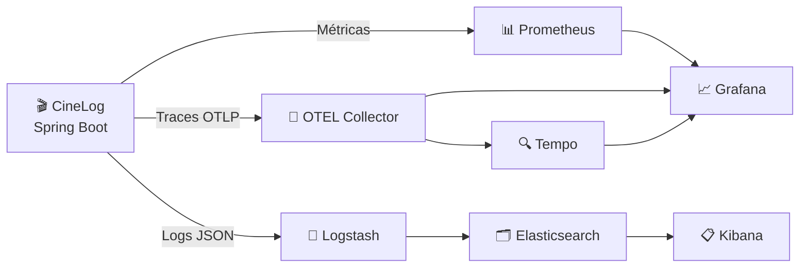

# 📊 Observability

> Logs, métricas e tracing distribuído no CineLog — os três pilares da observabilidade.

---

## Visão Geral



### Stack

| Pilar        | Tecnologias                                        |
| ------------ | -------------------------------------------------- |
| **Métricas** | Micrometer → Prometheus → Grafana                  |
| **Tracing**  | OpenTelemetry → OTEL Collector → Tempo → Grafana   |
| **Logs**     | Logback (JSON) → Logstash → Elasticsearch → Kibana |

---

## 1. Métricas (Prometheus + Grafana)

### Métricas de Negócio

| Métrica                            | Tipo    | Descrição             |
| ---------------------------------- | ------- | --------------------- |
| `cinelog.media.created`            | Counter | Mídias criadas        |
| `cinelog.media.updated`            | Counter | Mídias atualizadas    |
| `cinelog.watch_entry.created`      | Counter | Watch entries criados |
| `cinelog.recommendation.generated` | Counter | Recomendações geradas |
| `cinelog.auth.login.success`       | Counter | Logins bem-sucedidos  |
| `cinelog.auth.login.failure`       | Counter | Logins falhados       |

### Métricas de Segurança (A09:2025)

| Métrica                                | Tipo                | Descrição                          |
| -------------------------------------- | ------------------- | ---------------------------------- |
| `cinelog.security.events`              | Counter (tag: type) | Eventos de segurança por tipo      |
| `cinelog.security.alerts`              | Counter (tag: type) | Alertas disparados                 |
| `cinelog.security.rate_limit.rejected` | Counter             | Requests rejeitadas por rate limit |

### Métricas de Infraestrutura

| Métrica                             | Tipo  | Descrição                 |
| ----------------------------------- | ----- | ------------------------- |
| `http_server_requests_seconds`      | Timer | Latência de requests HTTP |
| `jvm_memory_used_bytes`             | Gauge | Memória JVM em uso        |
| `hikaricp_connections_active`       | Gauge | Conexões ativas no pool   |
| `resilience4j_circuitbreaker_state` | Gauge | Estado do circuit breaker |

### Coleta

```yaml
# Actuator (application.yml)
management:
    endpoints:
        web:
            exposure:
                include: health,info,prometheus
    metrics:
        export:
            prometheus:
                enabled: true
```

**Scrape config** do Prometheus (`prometheus.yml`):

```yaml
scrape_configs:
    - job_name: "cinelog"
      metrics_path: "/actuator/prometheus"
      static_configs:
          - targets: ["app:8080"]
```

### Grafana Dashboards

O projeto inclui 3 dashboards pré-configurados:

| Dashboard                        | Conteúdo                                                      |
| -------------------------------- | ------------------------------------------------------------- |
| **Business Metrics**             | Mídias criadas/dia, watch entries, recomendações, top gêneros |
| **Infrastructure & Performance** | Latência p50/p95/p99, RPS, error rate, JVM, HikariCP, Redis   |
| **Logs**                         | Agregação de logs por nível, busca por traceId                |

---

## 2. Logs (Logback + ELK)

### Formato JSON Estruturado

Cada linha de log é um JSON completo com campos padrão:

```json
{
    "@timestamp": "2025-01-15T10:30:00.123Z",
    "level": "INFO",
    "logger_name": "c.c.c.features.media.service.CreateMediaService",
    "message": "Media created: id=1, title=Inception",
    "thread_name": "http-nio-8080-exec-1",
    "traceId": "abc123def456",
    "spanId": "789ghi",
    "userId": "42",
    "correlationId": "req-550e8400"
}
```

### Appenders Configurados

| Appender     | Destino                     | Retenção | Conteúdo                                      |
| ------------ | --------------------------- | -------- | --------------------------------------------- |
| **CONSOLE**  | stdout                      | —        | Todos os logs                                 |
| **FILE**     | `logs/cinelog.log`          | 30 dias  | Todos os logs                                 |
| **SECURITY** | `logs/cinelog-security.log` | 90 dias  | Apenas eventos de segurança (Marker SECURITY) |

### MDC (Mapped Diagnostic Context)

O `ObservabilityContextFilter` popula o MDC com:

| Campo MDC       | Origem                                |
| --------------- | ------------------------------------- |
| `traceId`       | OpenTelemetry                         |
| `spanId`        | OpenTelemetry                         |
| `correlationId` | Header `X-Correlation-Id` (ou gerado) |
| `userId`        | JWT claim (se autenticado)            |
| `clientIp`      | `X-Forwarded-For` ou `RemoteAddr`     |

### Níveis de Log

| Logger                   | Nível | Justificativa          |
| ------------------------ | ----- | ---------------------- |
| `root`                   | INFO  | Default                |
| `com.cine.cinelog`       | INFO  | Aplicação              |
| `org.springframework`    | INFO  | Framework              |
| `org.hibernate.SQL`      | WARN  | Evitar poluição        |
| `io.github.resilience4j` | INFO  | Circuit breaker events |

---

## 3. Tracing Distribuído (OpenTelemetry + Tempo)

### Configuração

```yaml
management:
    tracing:
        sampling:
            probability: 1.0 # 100% em dev, reduzir em prod
    otlp:
        tracing:
            endpoint: http://localhost:4318/v1/traces
```

### Propagação de Contexto

O CineLog propaga contexto de tracing via **W3C Trace Context**:

```
Request → CineLog API → TMDb API
  ↓           ↓             ↓
trace-123  trace-123    trace-123
span-A     span-B       span-C
```

### Spans Customizados

A aplicação cria spans automaticamente via:

- **`@Measured`**: anotação customizada que cria spans + métricas para use cases
- **`IntegrationTracingAspect`**: instrumenta automaticamente chamadas a APIs externas
- **`AuditTrailAspect`**: spans para operações auditáveis

### Visualização

Acesse o **Grafana** em http://localhost:3000 e navegue para:

- **Explore** → **Tempo** → Busca por `traceId`
- Dashboard **Logs** → Clique em qualquer log → Link para trace

---

## 4. Health Checks

### Endpoints

| Endpoint                     | Descrição                          |
| ---------------------------- | ---------------------------------- |
| `/actuator/health`           | Status geral (UP/DOWN)             |
| `/actuator/health/db`        | MySQL                              |
| `/actuator/health/redis`     | Redis                              |
| `/actuator/health/tmdb`      | TMDb API (circuit breaker + probe) |
| `/actuator/health/outbox`    | Fila outbox (pendentes + falhas)   |
| `/actuator/health/diskSpace` | Espaço em disco                    |

### Health Indicators Customizados (A10:2025)

**TmdbHealthIndicator**: verifica estado do circuit breaker + probe HTTP ao TMDb
**OutboxHealthIndicator**: detecta acúmulo de eventos pendentes ou falhas permanentes

---

## 5. Alerting

### Regras do Prometheus (exemplos)

```yaml
# Alta taxa de erros
- alert: HighErrorRate
  expr: rate(http_server_requests_seconds_count{status=~"5.."}[5m]) > 0.1
  for: 5m
  labels:
      severity: critical

# Latência alta
- alert: HighLatency
  expr: histogram_quantile(0.95, http_server_requests_seconds_bucket) > 2
  for: 5m
  labels:
      severity: warning

# Pool de conexões esgotado
- alert: DatabaseConnectionPoolExhausted
  expr: hikaricp_connections_active / hikaricp_connections_max > 0.9
  for: 2m
  labels:
      severity: critical
```

### Alertas de Segurança (A09:2025)

Thresholds configuráveis em `application.yml`:

| Métrica                | Threshold | Janela |
| ---------------------- | --------- | ------ |
| Auth failures          | 10        | 5 min  |
| SQL injection attempts | 3         | 5 min  |
| Rate limit violations  | 50        | 5 min  |
| Tamper detection       | 1         | 5 min  |

---

## Como subir o stack de observabilidade

```bash
# Stack completa
docker compose -f docker-compose.yml -f docker/docker-compose.observability.yml up -d

# Acessar
open http://localhost:3000    # Grafana (admin/admin)
open http://localhost:9090    # Prometheus
open http://localhost:16686   # Jaeger
open http://localhost:5601    # Kibana
```

---

## Troubleshooting

| Problema               | Verificação                                            |
| ---------------------- | ------------------------------------------------------ |
| Métricas não aparecem  | Verifique `/actuator/prometheus` no navegador          |
| Traces ausentes        | Verifique se OTEL Collector está recebendo em `:4318`  |
| Logs não chegam ao ELK | Verifique pipeline do Logstash em `logstash/pipeline/` |
| Circuit breaker state  | Consulte `/actuator/health/tmdb`                       |
| Correlação de logs     | Use o `traceId` para buscar logs + traces              |
